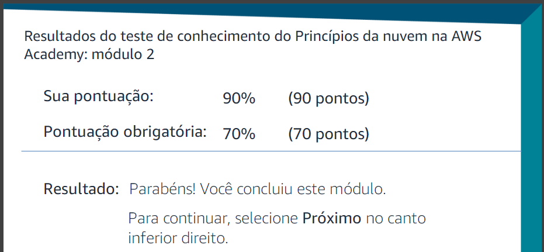

# Questão 01

0,9 \* 0,5 = 0,45

# Questão 02

Link para o calculo do custo mensal: [Custo Mensal](https://calculator.aws/#/estimate?id=4ee3fdf4d060013de344da65ca07f105285906d8)

Foi utilizado principalmente dois serviços para essa estimativa, Amazon EC2 e Amazon RDS (Oracle).

### Serviço de Máquinas Virtuais (Amazon EC2):

Com base nos requisitos fornecidos, fiz a escolha de um únca instância c6g.16xlarge da família c6g para o Amazon EC2. Esta instância compartilhada, compatível com Linux, é ideal para uma carga de trabalho de uso constante. Com 64 vCPUs e 128 GB de memória, atende aos requisitos de 64 cores e 128 GB de RAM do ambiente on-premises. A capacidade de processamento consistente e escalável dessa instância, combinada com armazenamento EBS opcional de 256 GB, garante desempenho e capacidade de armazenamento adequados para a migração para a nuvem.

### Serviço de Banco de Dados (Amazon RDS(Oracle)):

Para o banco de dados decidi escolher a instância db.m5.large, pois ele atentende os requisitos para o mesmo. Essa instância oferece 2 vCPUs e 8 GB de memória, infezlimente não consegui achar uma instância com menos de 8 GB de memória. Já para o armazenamento, foi escolhido um SSD de uso geral (gp2) com 512 GB, que atende aos requisitos de armazenamento. De forma geral, essas escolhas foram pensadas para conseguir os requisitos minimos para a migração, falhando apenas na memória do banco de dados.

### Custo Mensal:

Da forma que foi configurado, o custo mensal foi de **1.842,60 USD**, e o custo anul foi de **22.111,20 USD**. Não foi cobrado custo inicial.

Não sei se foi a melhor escolha, mas foi a que eu consegui pensar com base nos requisitos fornecidos e com base no meu conhecimento atual.