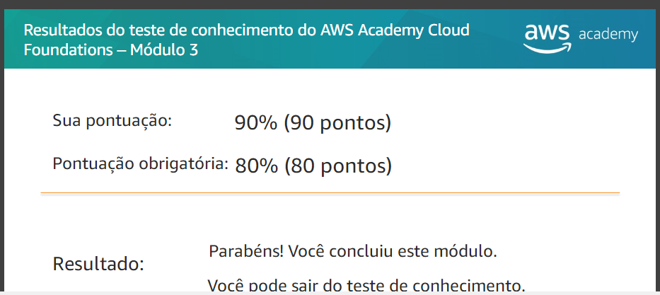

# Questão 01

0,9 \* 1 = 0,9

# Questão 02

1.
    1. **Proximidade dos usuários finais:** Para reduzir a latência e melhorar o desempenho da aplicação.

    2. **Conformidade e regulamentações:** Se a região escolhida está em conformidade com as regulamentações e requisitos de conformidade.

    3. **Disponibilidade de serviços:** Se a região oferece todos os serviços necessários para suportar sua aplicação e infraestrutura.

    4. **Preços e custos:** Avalia os preços e custos dos serviços na região, incluindo taxas de transferência de dados, armazenamento...

    5. **Resiliência e redundância:** Considera a resiliência e a redundância da infraestrutura na região.

    6. **Limitações regionais:** Avalia quaisquer limitações regionais específicas, como restrições de serviços ou recursos disponíveis apenas em determinadas regiões.

2.
    - **América do Norte:**
        - AWS GovCloud (EUA-Leste): 3
        - AWS GovCloud (Oeste dos EUA): 3
        - Canadá (Central): 3
        - Canadá Oeste: 3
        - Norte da Califórnia: 3
        - Norte da Virgínia: 6
        - Ohio: 3
        - Oregon: 4
    
    - **América do Sul:**
        - São Paulo: 3
    
    - **Europa:**
        - Espanha: 3
        - Europa (Estocolmo): 3
        - Frankfurt: 3
        - Irlanda: 3
        - Londres: 3
        - Milão: 3
        - Paris: 3
        - Zurique: 3

    - **Oriente Médio:**
        - Bahrein: 3
        - EAU: 3
        - Tel Aviv: 3

    - **Regiões da AWS na África:**
        - Cidade do Cabo: 3
    
    - **Ásia-Pacífico:**
        - Cingapura: 3
        - Hong Kong (RAE): 3
        - Hyderabad: 3
        - Jacarta: 3
        - Mumbai: 3
        - Ningxia: 3
        - Osaka: 3
        - Pequim: 3
        - Seul: 4
        - Tóquio: 4

    - **Austrália e Nova Zelândia:**
        - Melbourne: 3
        - Sydney: 3

# Questão 03

**Armazenamento:**
1. **Amazon S3 (Simple Storage Service):** Serviço de armazenamento de objetos altamente escalável e durável.
[Documentação do Amazon S3](https://docs.aws.amazon.com/AmazonS3/latest/dev/Welcome.html)

2. **Amazon EBS (Elastic Block Store):** Armazenamento de blocos persistentes para uso com instâncias EC2.
[Documentação do Amazon EBS](https://docs.aws.amazon.com/ebs/index.html)

3. **Amazon Glacier:** Serviço de armazenamento de arquivos de baixo custo, ideal para arquivamento de longo prazo e backup.
[Documentação do Amazon Glacier](https://docs.aws.amazon.com/amazonglacier/latest/dev/introduction.html)

**Computação:**
1. **Amazon EC2 (Elastic Compute Cloud):** Serviço de computação em nuvem que oferece capacidade de processamento escalável sob demanda.
[Documentação do Amazon EC2](https://docs.aws.amazon.com/ec2/index.html)

2. **AWS Lambda:** Serviço de computação serverless que executa código em resposta a eventos sem a necessidade de provisionamento de servidores.
[Documentação do AWS Lambda](https://docs.aws.amazon.com/lambda/index.html)

3. **Amazon ECS (Elastic Container Service):** Serviço de orquestração de contêineres altamente escalável e de alta performance.
[Documentação do Amazon ECS](https://docs.aws.amazon.com/AmazonECS/latest/developerguide/Welcome.html)

**Banco de Dados:**
1. **Amazon RDS (Relational Database Service):** Serviço gerenciado de banco de dados relacional que simplifica a configuração, operação e escalabilidade de bancos de dados.
[Documentação do Amazon RDS](https://docs.aws.amazon.com/rds/index.html)

2. **Amazon DynamoDB:** Banco de dados NoSQL totalmente gerenciado, escalável e de baixa latência.
[Documentação do Amazon DynamoDB](https://docs.aws.amazon.com/amazondynamodb/latest/developerguide/Introduction.html)

3. **Amazon Aurora:** Banco de dados relacional compatível com MySQL e PostgreSQL, oferecendo alta performance, disponibilidade e escalabilidade.
[Documentação do Amazon Aurora](https://docs.aws.amazon.com/AmazonRDS/latest/AuroraUserGuide/CHAP_Aurora.html)

**Rede e Entrega de Conteúdo:**
1. **Amazon VPC (Virtual Private Cloud):** Serviço que permite criar uma rede virtual isolada na AWS.
[Documentação do Amazon VPC](https://docs.aws.amazon.com/vpc/index.html)

2. **Amazon Route 53:** Serviço de DNS escalável e altamente disponível.
[Documentação do Amazon Route 53](https://docs.aws.amazon.com/route53/index.html)

3. **Amazon CloudFront:** Serviço de CDN (Content Delivery Network) que oferece distribuição de conteúdo de forma rápida e segura.
[Documentação do Amazon CloudFront](https://docs.aws.amazon.com/AmazonCloudFront/latest/DeveloperGuide/Introduction.html)