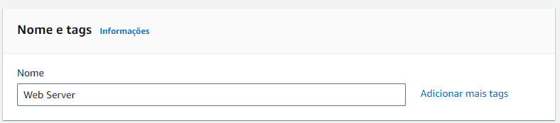
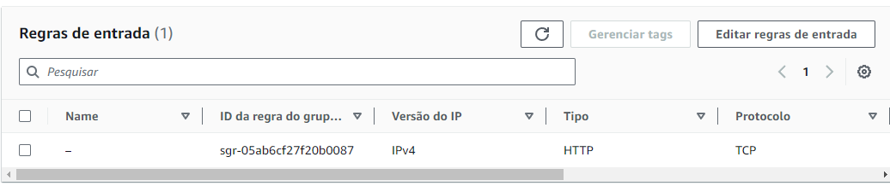
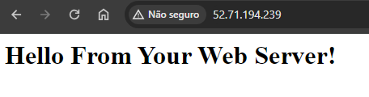

# Questão 01

0.8 * 1 = 0.8

# Questão 02

- **Tarefa 1: Iniciar a instância do Amazon EC2**
    - Selecinando menu de Serviços, computação e então EC2
    
    - Executando instância  
        

    - **Etapa 1: Nome e tags**
        - Definindo nome da instância que será armazena como tag  
            
        
    - **Etapa 2: Imagens do aplicativo e SO**
        - Verificando configurações padrão para "Amazon Linux 2023 AMI"  
            
    
    - **Etapa 3: Tipo de instância**
        - Conferiando o tipo de instância padrão "t2.micro"
    
    - **Etapa 4: Par de chaves (login)**
        - Usando par de chaves especificado "vockey"
    
    - **Etapa 5: Configurações de rede**
        - Selecionando "Lab VPC" e Criando grupo de segurança  
            
        - Removendo regra padrão
    
    - **Etapa 6: Configurar o armazenamento**
        - Verificando as configurações padrão
    
    - **Etapa 7: Detalhes avançados**
        - Ativando "Proteção contra encerramento"
        - Colando código na caixa "Dados do usuário"  
            
        
    - **Etapa 8: Executar a instância**
        - Executando instância  
            
        - Selecionando "Visualizar todas as instâncias"
        - Verificando "Detalhes" e aguardando a instância entrar em execução  
            
    
- **Tarefa 2: Monitorar a instância**
    - Verificando status e constanto que a instância passou nas duas verificações  
        

    - Verificando métricas através de 7 gráficos diferentes na aba de "Monitoramento"

    - Verificando log do sistema  
        
    
    - Verificando captura de tela da instância  
        

- **Tarefa 3: Atualizar o grupo de segurança e acessar o servidor web**
    - Voltando ao "Detalhes" da instância e copiando o endereço IPv4 público

    - Abrindo nova aba e tentando acessar o servidor web sem sucesso, já o grupo de segurança não permite o tráfego de entrada na porta 80, usada para solicitações HTTP da web

    - Acessando Grupos de Segurança -> Web Server security group -> Regras de entrada -> Editar regras de entrada -> Adicionar regra  
        
    
    - Voltando a nova aba e atualizando a página, vemos que a regra adicionada funcionou  
        
    
- **Tarefa 4: Redimensionar a instância: tipo de instância e volume do EBS**
    - Interrompendo instância. Instância interrompida.

    - Configurações de instância -> Alterar proteção contra interrupção -> Ativar

    - Modificando volume de 8gb para 10gb

    - Iniciando instância novamente

- **Tarefa 5: Explorar os limites do EC2**
    - Service Quotas -> Serviços da AWS -> ec2 -> Amazon Elastic Compute Cloud (Amazon EC2) -> Encontrar cotas -> running on-demand  
        
    
- **Tarefa 6: Testar a proteção contra interrupção**
    - Estado da instância -> Interromper instância. Erro mostra que a proteção está funcionando  
        

- **O tempo do console acabou, porém essa era a última tarefa e só faltava interromper a instância e sair**

# Questão 03
Drive: https://drive.google.com/file/d/1NBWb_MSu2G0nwv9UCmh3Z3hSgEWzR1ME/view?usp=sharing

# Questão 04
Drive: https://drive.google.com/file/d/1o4Ct_mcmN5lii0YxxTBig7p5eefiQDuX/view?usp=sharing

        
    